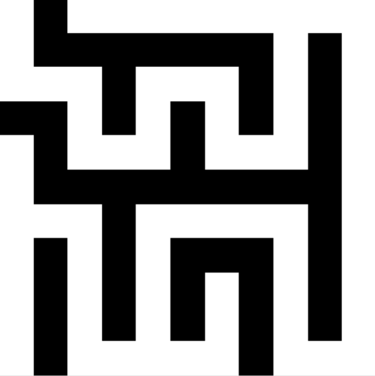
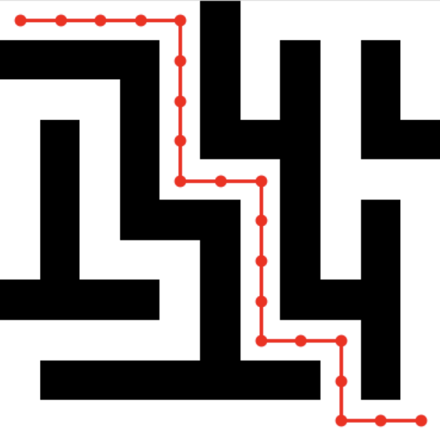

# Maze Solver & Generator

Tento projekt se zabývá načítáním, řešením a generováním bludišť. Podporuje práci s bludišti reprezentovanými jako matice `n × n`, kde levý horní roh je vstup a pravý dolní roh je výstup. Projekt používá knihovnu NumPy pro práci s daty a generuje výstupní obrázky, které znázorňují řešení.

## Funkcionality

- Načtení bludiště z CSV souboru 
- Reprezentace bludiště pomocí NumPy matice (`True` = zeď, `False` = průchod)
- Sestavení incidenční matice pro grafové reprezentace bludiště
- Hledání nejkratší cesty pomocí Dijkstrova algoritmu
- Vykreslení výsledku jako obrázku (černá = zeď, bílá = průchozí, červená = nejkratší cesta)
- Generování bludiště s garantovanou průchodností
- více šablon (např. `empty`, `slalom`, ...)

## Načtení bludiště z CSV souboru 
``` 
maze = Maze.load_from_file("examples/example_maze.csv") 
```
## Generování bludiště
```
maze2 = Maze.generate(9, 9, filename="examples/generated_maze.csv")
```
## Hledání nejkratší cesty
```
path = find_path(maze)
if path is None:
    print("No path found")
```
## Ukázky


